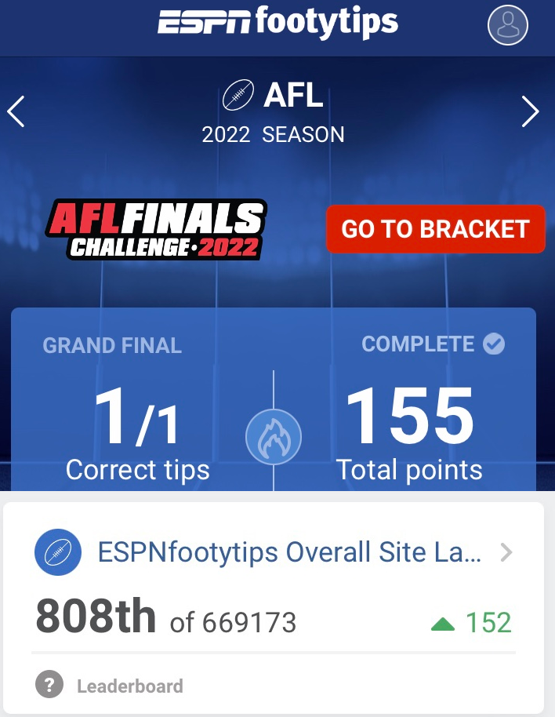
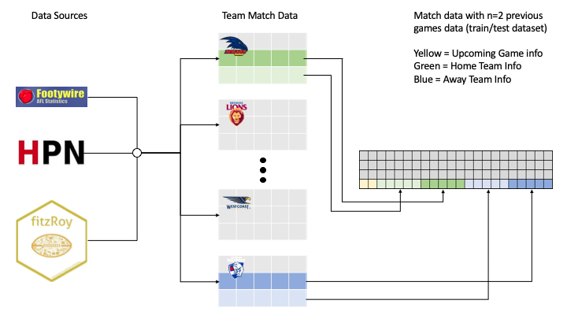
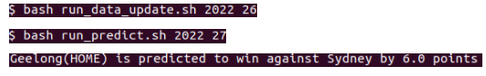

# Contents
{:.no_toc}
* Data 
{:toc}

<br />

## Summary
Using data from a variety of dedicated AFL stats datasets I was able to assemble a test and training dataset to train XGBoost models to predict the 2022 season round by round. This method resulted in 155 correct tips and ranking me 808th out of 669,173 for the ESPN footy tips competition. The XGBoost models were trained on match stats for the previous games along with data for the upcoming games. The models, code and combined dataset are available in the repository for this project.


    
Feel free to contact me at mitchgill16@gmail.com with any questions or view my [personal website]() (currently under development)  to check out other projects I've worked on.
    
Special thanks to my fiancée Rebecca who has listened to me ramble about this project over the last couple years and has heard the phrase ‘I’m just gonna quickly update the model’ or ‘I’m just running the predictions’ more times than anyone should hear. Additional thanks to Philipp Bayer, who is someone I look up to and was also my supervisor whilst I was at uni. During this time he helped my develop my skills for my university projects which has transferred over into to making this personal project possible. Check out his [twitter](https://twitter.com/PhilippBayer) for the cool work he’s doing at the Minderoo foundation.

## Background
At the start of 2020 I joined the Applied Bioinformatics Group to complete the required reserach project for my Masters degree. The project was going to have a Machine Learning (ML) focus. The ML focus was used to predict soybean traits from genetic information (Recently published [here](https://bmcplantbiol.biomedcentral.com/articles/10.1186/s12870-022-03559-z)). However, as we all know COVID happened. During the lockdowns and restrictions and delays to my Masters project, I wanted to practice and upskill my python skills whilst learning how to use ML. I thought an interesting way to practice this was to combine it somehow with my passion for AFL.

I'm a diehard Freo supporter and will probably watch most other games on. I also really like what [squiggle does](https://squiggle.com.au/) along with others in this space. So I got to work learning how to implement ML in python, did coursera’s deep learning classes & made plenty of mistakes and questionable design choices which would be fixed and changed during the course of a couple years of on & off work, edits and practice.

## Acquiring the Data & Making the Dataset
The first step in this project was to gather data sources for each game that has been played, to build a dataset. I decided to build (a fairly naive) webscraper which scraped every match from 2013 onwards from the [footywire website](https://www.footywire.com/) and stored them in team spreadsheets with both basic stats and advanced stats available on the website. I later added in data from the FitzRoy package to acquire the venue, ladder and lineup information for each of these games. And finally to account for the impact of individual players I added in a team aggregated Player Approximate Value (PAV) from [HPN footy](https://www.hpnfooty.com/) to determine a value system for each of the lineups for each team for each match.

Once the dataset had been acquired for each game and allocated to each team, it was then time to assmeble the train/test dataset. The project works by using n previous games worth of information, along with data that is possible to know about the upcoming games. An example row in the dataset would contain the upcoming season, upcoming roud, home team, away team, upcoming venue, ladder information before the upcoming round (eg wins, losses, ladder positions, form), PAV of home team for upcoming game, PAV of away team for upcoming game, home team prevous game statistics (from 1 game previous to n game previous, where n will equal 2,3 or 10 depending on which XGBoost model is being trained) and then away team previous games statistics (from 1 game previous to n game previous, where n will equal 2,3 or 10 depending on which XGBoost model is being trained). For the classification models, each rows 'outcome' label will either be 0 for home team win or draw, or 1 for away team win. For regression models the outcome label which would be the margin from the home team perspective. Eg if the hometeam lost the margin would be negative.

Below is an example of acquiring and combining the data to make a dataset where n previous games equals 2. This process would be repeated for n=3 and n=10.

      
## Training the Models
With the datasets assembled as described above for n previous games (where n = 2,3,10) along with what would be possible to know about the upcoming game such as venue and team PAV's it was time to start training some models. After a lot of experimentation, hyperparamter tuning and trial + error optimisation I decided that XGBoost models generally had the best performance. I also noticed that the models with only the more recent games tended to be more volatile with their predictions. For example, the models trained on 2 games worth of previous data would sometimes pick North Melbourne for 2021 games. This worked in reverse with models trained on 10 games worth of data sometimes being be too conservative and not accouningt for sudden upticks in form. After some further trial and erorr it appeared that combining the predictions of these models to use a 'best of 3 approach' to make a prediciton seemed to add 2-3% to prediction accuracy. The most recent run of model training had a 67.95% tipping accuracy and about 2.88%SD for the stratified k-fold (k=10) testing. I also trained a regression model at the same time to get a margin prediction, although this was not a focus of the project. It tended to be conservative as expected and would often predict margings on 5-15 to account for the possibility of the correct margin being in favour of the team it did not predict to win. The RMSE was ~36 with a SD of ~2.5

Some example code for the training of the models and returning the most accurate model of the K-Fold Splits.
```
#x = all train/test data
#y = labels of whether home team (0) or away team (1) won
#my = labels of margins from home team perspective. 
#m = xgb classifier with tuned hyper-parameters.
#mm = xgb regressor with tuned hyper-parameters
def eval_xgb_games_margins(x, y, m, my, mm):
    results = []
    error = []
    count = 0
    best_w = m
    high_w = 0
    best_m = mm
    high_m = 100
    cv = StratifiedKFold(n_splits=10, shuffle=True)
    for train,test in cv.split(x,y):
        prediction = m.fit(x.loc[train],y.loc[train]).predict_proba(x.loc[test])
        margin_pred = mm.fit(x.loc[train], my.loc[train])
        y_pred = m.predict(x.loc[test])
        m_pred = mm.predict(x.loc[test])
        predictions = [round(value) for value in y_pred]
        #sees how accurate the model was when testing the test set
        accuracy = accuracy_score(y.loc[test], predictions)
        pcent = accuracy * 100.0
        print("The accuracy of this model is" + str(pcent))
        rmse = sqrt(mean_squared_error(m_pred, my.loc[test]))
        print("The rmse of this model is" + str(rmse))
        results.append(pcent)
        error.append(rmse)
        #change the best model to equal current model
        if(pcent > high_w):
            print("found new best classifier")
            best_w = m
            high_w = pcent
        if(rmse < high_m):
            print("found best new regressor")
            best_m = mm
            high_m = rmse
    print("Best win percentage split = " +str(high_w))
    print("Best margin rmse = "+str(high_m))
    print("Training Testing Accuracy: %.2f%% (%.2f%%)" % (np.mean(results), np.std(results)))
    print("Training Testing Margins: %.2f%% (%.2f%%)" % (np.mean(error), np.std(error)))
    return best_w, best_m
```
      
## Round by Round Prediction of the 2022 Season
So this is all well and good that the model could predict games results for games that had already happened. However, I wanted to be able to update my dataset with the data from the round just gone by and then predict games from the upcoming round. With the help of the [fitzRoy](https://github.com/jimmyday12/fitzRoy) fixture fetch function, I made a way to get upcoming home & away teams, upcoming game information, current ladder information and lineups (once they’re announced) to assign an aggregated PAV value for each team. I then gathered the n most recent games worth of information for both the home and away team and combined this as an input that can be used by the model for prediction.

The process for each round would be to update the train/test dataset with the previous rounds information, wait for teams to be announced and then predict the upcoming round. I’d then set my tips as the models best of 3 prediction along with margin. As of some of the more recent edits it will print out the predictions to the command line. If you're interested in updating the dataset and doing the predictions yourself round by round for 2023, follow the readme in the [repository](https://github.com/mitchgill16/AFL_Data) for this project.

An example here of getting the dataset ready for the grand final round and then predicting the grand final.


Overall, this project worked very well for tipping this season, achieving an accuracy of 74.88%. This outperformed the training testing accuracy suggesting that this season did not have a lot of upsets. Additionally, it suggests that the model did get fortunate with 50/50 games & some upsets. For example, it tipped Gold Coast to beat Richmond when most tippers picked Richmond, and fortunately for me, Noah Anderson kicked a goal after the siren. I would expect this trend to balance out in the long run as more seasons will include a higher amount of upsets along side with the evidence that close games tend to balance out to be roughly 50/50 over time, unless you’re 2022 Collingwood, but they’ll [regress to the mean eventually.](https://twitter.com/DanielCherny/status/1571072807051866113?ref_src=twsrc%5Etfw) 
      
## Code & Conclusion
Code is available to download and play around with or if you want to use the data I’ve collected and combined from other data sources. The actual parameters and training of the models occurs in the ML_models jupyter notebook. The prediction jupyter notebook is a precursor before I started trying to automate the process a bit more by making most of the code executeable scripts from bash scripts.

Overall I’m pretty happy with this project and how its grown over the years. I intend to update the data round by round and do predictions for the 2023 season. I would like to try and fix the webscraper for the footywire data as this was something I made in April 2020, and after 2-3 years more experience with python I think I could improve the efficiency of the system that is in place. I would also like to further interpret how the models make predictions and what aspects of the dataest the model deems important, as ML interpretability and explainability are interests of mine. Additionally I think i'll be aiming to expand my data science skills in the sports data science space, so if you're reading this and have an opportunity or idea for me, feel free to contact me.
